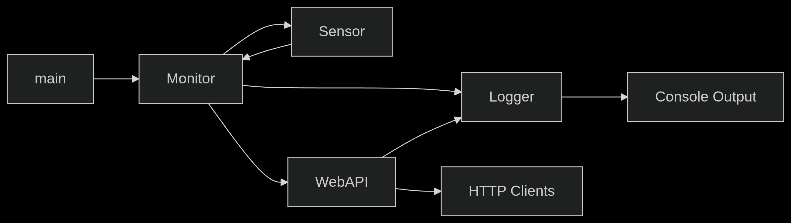
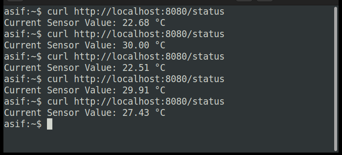
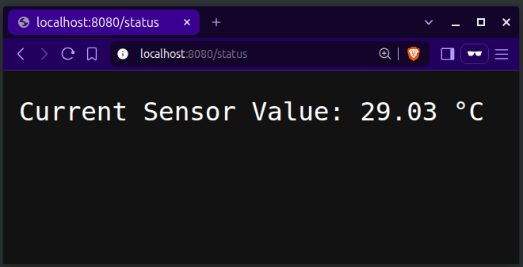
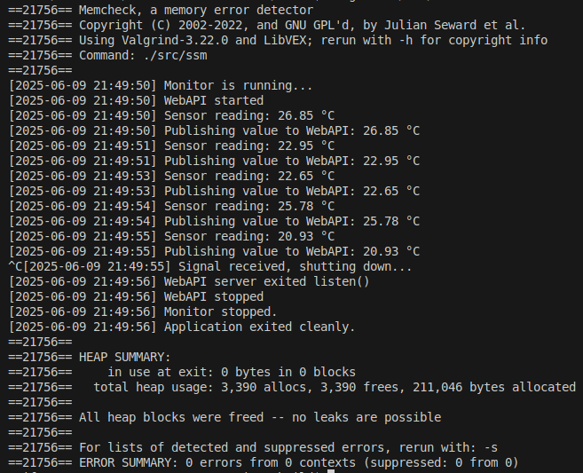
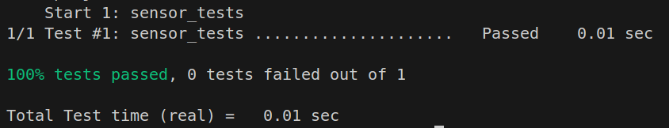

# Sensor Monitor Demo

The demo application is a simulated sensor monitoring system that periodically reads a temperature value from a sensor, logs the reading, and publishes it to a web API. The web API makes the latest reading available via an HTTP endpoint. The system is designed to be shut down cleanly upon receiving a signal.

## The Demo Includes

- Sensor simulator (temperature)
- Periodical read of temperature values  
- Publish readings via a RESTful Web API  
- Logs data to the console  
- Modern C++ techniques and best practices
- Unit-test for the sensor module using Catch2 v3
- Clean shutdown via signal handling
- CMake-based build system
- Valgrind clean (no leaks)

## Implementation Overview

This project consists of several interconnected modules that work together to create a sensor monitoring system with web API capabilities. Below is an architectural breakdown:

### 1. Sensor

**Purpose:**  
Simulates a temperature sensor, generating realistic values between 20-30°C.

**Implementation:**

- Uses `std::mt19937` pseudo-random number generator.
- Uses `std::uniform_real_distribution` to simulate temperature.
- Seeded with `steady_clock::now()` to ensure variation between runs.
- Provides `read_value()` that returns current simulated temperature.
- Thread-safe when accessed via Monitor.

**Key C++ techniques:**

- `std::mt19937`
- `std::uniform_real_distribution`
- RAII
- `noexcept` constructor/destructor

### 2. Logger

**Purpose:**  
Thread-safe logging facility with timestamps.

**Implementation:**

- Implements the **Singleton pattern**, one instance per application.
- Internal `std::mutex` to serialize calls to `log()`.
- Logs messages to `std::cout` with a timestamp.
- `log()` function is `noexcept` to guarantee safety.
- Non-copyable, non-movable (Rule of 5) for proper Singleton behavior.

**Key C++ techniques:**

- Singleton pattern
- `std::lock_guard`
- `std::ostringstream`, `std::put_time`
- Rule of 5
- `noexcept`

### 3. Monitor

**Purpose:**  
Main control loop of the application.

**Implementation:**

- Owns instances of `Sensor` and `WebAPI`.
- Periodically calls `sensor.read_value()`.
- Logs each reading.
- Publishes the latest sensor value to the WebAPI.

**Key C++ techniques:**

- RAII
- `std::this_thread::sleep_for`
- `std::ostringstream`
- Encapsulation

### 4. WebAPI

**Purpose:**  
Expose sensor values over an HTTP API.

**Implementation:**  

- Uses **cpp-httplib** embedded HTTP server.
- Starts the server in a background thread.
- Provides a `/status` endpoint returning the latest sensor value.
- Protects shared `latest_value` using `std::atomic<double>` and `std::mutex`.
- Exposes `start()` and `stop()` methods for clean lifecycle control.

**Key C++ techniques:**

- `std::thread`
- `std::atomic`
- `std::mutex` and `std::lock_guard`
- Lambda capture `[this]`
- RAII

### Data Flow



## Project Structure

```bash
.
├── CMakeLists.txt          
├── src/                   
│   ├── main.cpp
│   ├── Logger.cpp/hpp
│   ├── Sensor.cpp/hpp
│   ├── Monitor.cpp/hpp
│   ├── WebAPI.cpp/hpp
│   └── CMakeLists.txt
├── tests/
│   ├── test_sensor.cpp
│   └── CMakeLists.txt
└── README.md

```

## Build & Run

### Prerequisites

- Linux system with the latest stable release of:
  - `g++`
  - `cmake`  
  - `make`
  - `valgrind`
  - `catch2`
  - `git`

- To install the dependencies run the following command in a linux terminal

  ```bash
  sudo apt install g++ cmake make valgrind catch2 git
  ```

### Build Steps

- Clone the repo

  ```bash
  git clone https://github.com/mechasif/sensor-monitor-demo.git
  ```

- Change directory to `sensor-monitor-demo`

  ```bash
  cd sensor-monitor-demo
  ```

- Create build directory

  ```bash
  mkdir build
  ```

- Change directory to `build`

  ```bash
  cd build
  ```

- Configure with CMake

  ```bash
  cmake ..
  ```

- Build the project

  ```bash
  make
  ```

### Running the Application

- Inside the `build` directory run the following command

  ```bash
  ./src/ssm
  ```

- Example output on the console:

  ```bash
  [2025-06-08 23:46:30] Monitor is running...
  [2025-06-08 23:46:30] WebAPI started
  [2025-06-08 23:46:30] Sensor reading: 28.89 °C
  [2025-06-08 23:46:30] Publishing value to WebAPI: 28.89 °C
  ```

### Interacting with Web API

- From another terminal run the command

  ```bash
  curl http://localhost:8080/status
  ```

- Example output on the console:
  
  

- To check the output on to a browser, open your choice of browser and paste the following link in the address box.
  - <http://localhost:8080/status>

  - Example output:

    

### Stopping the application

Press `Ctrl+C` → application will exit cleanly after logging

- Example output:

  ```bash
  [2025-06-08 23:47:31] Sensor reading: 29.13 °C
  [2025-06-08 23:47:31] Publishing value to WebAPI: 29.13 °C
  ^C[2025-06-08 23:47:31] Signal received, shutting down...
  [2025-06-08 23:47:32] WebAPI server exited listen()
  [2025-06-08 23:47:32] WebAPI stopped
  [2025-06-08 23:47:32] Monitor stopped.
  [2025-06-08 23:47:32] Application exited cleanly.
  ```

## Memory Leak Status

- The application has been checked with the `valgrind` memory error detector to investigate any potential memory leak.

- No leaks were found. Here's a output from the tool

  

## Unit Test for Sensor

- The `sensor` module has been unit tested to confirm the simulated sensor value ranges between 20°C to 30°C.

- Here's a quick report of the test status

  

## Potential Improvements / TODOs

- Add multiple sensor types (humidity, pressure, etc.)
- Return JSON with timestamp in `/status` endpoint
- Add CLI arguments for configuration (port number, interval, etc.)
- Add GitHub Actions CI pipeline for build & test
- Containerize with Docker for easier deployment

## License

This project is licensed under the MIT License. See  [LICENSE](https://github.com/mechasif/sensor-monitor-demo/blob/main/LICENSE) for details.

## Final Notes

This project was built as part of embedded Linux-based modern C++ demo and shows:

- Modern C++ idioms and best practices
- CMake best practices
- Multithreading and signal handling
- REST API development in C++
- Unit testing with Catch2
- Memory leak checking with Valgrind
- Feel free to explore, extend, and adapt!
